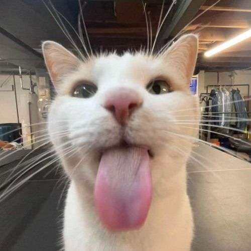

# DEADCATS

Diethylazodicarboxylate, conventionally abbreviated as **DEAD** and sometimes as **DEADCAT**, is an organic compound with the structural formula (C₆H₁₀N₂O₂), which is also—somehow—a CTF-playing Cybersecurity team.

We actively participate in online and on-site CTF competitions. We are a group of Cybersecurity Wizards interested in various areas including software security, web security, cryptography, IoT security, etc.

📧 Contact us at: **0xdiethylazodicarboxylate@gmail.com**

---

# Team Members

> No Mercy, No Meow.
>
> Hack for fun, not for profit.
>
> Maybe for little profit also.
>
> Anarchy and Cooked team.

---

## Active Members

|                                                                                         |                                                                                                                                                                                                         |
| :-------------------------------------------------------------------------------------: | :------------------------------------------------------------------------------------------------------------------------------------------------------------------------------------------------------ |
|                   | **At0m** Why can't you trust At0m? Because they make everything up. Category: Web/Rev/Pwn Home: [At0mXploit](//github.com/At0mXploit) Discord: [@At0mXploit](//discord.com)                 |
|  | **0x0w1z** Clicks links, finds flags, disappears. Regrets over Autopsy (can't install) Category: Forensics/Crypto Site: [0x0w1z](//0x0w1z.github.io/) GitHub: [0x0w1z](//github.com/0x0w1z) |
|                     | **P0u** Just here for sanity. Installs SageMath once, regrets it forever. Category: Web/Crypto GitHub: [P0u](//github.com/NidanPoudel)                                                         |
|         | **404Buddha** Enlightened. Breaks security for inner peace. Category: Web/Rev/Pwn Site: [404Buddha](https://rhythmkafle.github.io/) GitHub: [404Buddha](//github.com/rhythmkafle)           |
|                 | **BeNoM** Glitched into existence.. Category: Web Discord: [@Benom0069](//discord.com)                                                                                                         |

---

# Historical Active Members

**Nobody till now.**

---

# 🧠 Skills in the Team

**Web** • **Pwn** • **Crypto** • **OSINT** • **Reverse Engineering** • **Forensics** • _and everything in between_

---

# Motto

> **We break things to learn.**  
> We build things to teach.  
> Always **learning**. Always **playing.**

---

# 🔗 Links & Join Us

- **CTFtime**: [Diethylazodicarboxylate](https://ctftime.org/team/367609)
- **GitHub**: [Diethylazodicarboxylate](https://github.com/Diethylazodicarboxylate)
- **Twitter / X**: [0xDEADCATS](https://x.com/0xdeadcats)
- **Join us**: Send an application on our Discord → [Diethylazodicarboxylate](https://discord.gg/nzNcrpyzwf)
